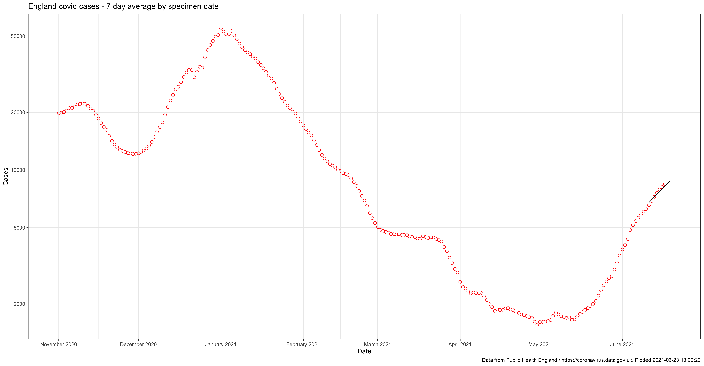
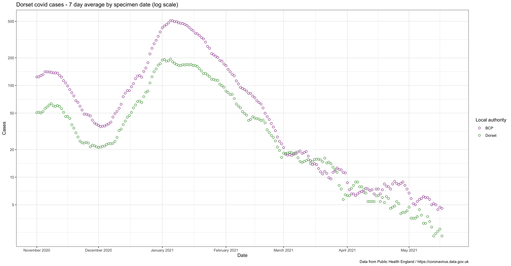
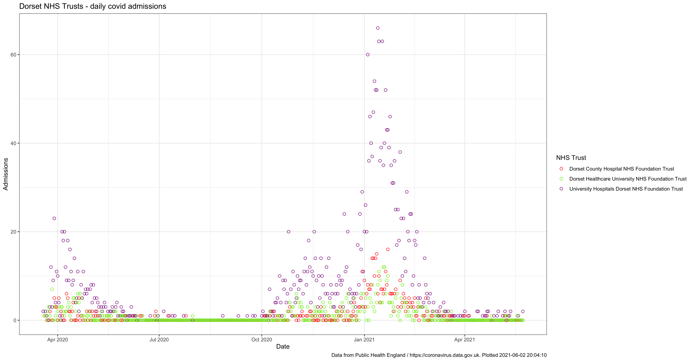

# Andrew's Dorset covid statistics

This is the output of me playing around with the R statistical programming language and the coronavirus data produced on a daily basis by Public Health England and published at https://coronavirus.data.gov.uk.

I'm publishing these interpretations of data already in the public domain purely for my personal interest. 

## England daily cases

## Dorset daily cases

## Dorset daily hospital admissions
